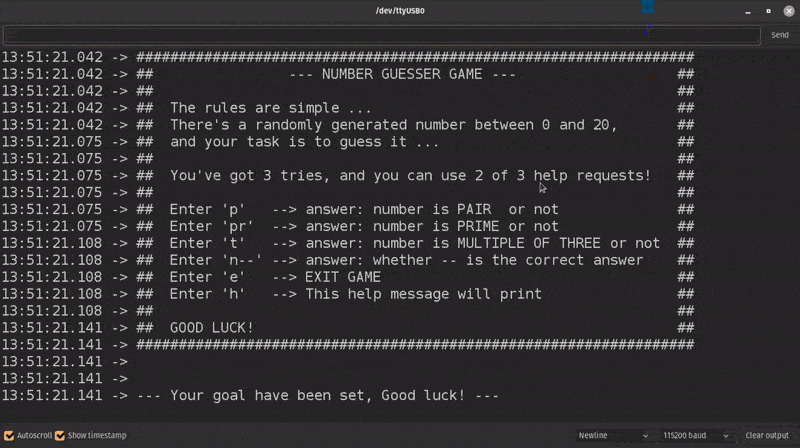

# Number guesser interactive game on the ESP32 for bitwise operations training

This is an interactive game with a handful of possible interactions between the code and the player for a fun guessing game.

Basically, the player's task is to guess a number between 0 and 20 that's randomly generated. The player can ask for 2 of three available hints:

- Is the number **pair** by sending **p**
- Is the number **prime** by sending **pr**
- Is the number a **multiple of three** by sending **t**

The player has a **maximum** of **3** guesses.

Here's a running demo of a gameplay:

---

The training on bitwise operations and bitmasks was in the use of a single byte for handling all states and flags of the game.

The byte was structured as shown here:

\------------------------------------------------------------------------- 

 |  WIN  | PAIR  | THREE | PRIME |       TRIES       |       STATE       | 

\------------------------------------------------------------------------- 

 | 1 bit | 1 bit | 1 bit | 1 bit | TRIES_1 | TRIES_0 | STATE_1 | STATE_0 | 

\------------------------------------------------------------------------- 
